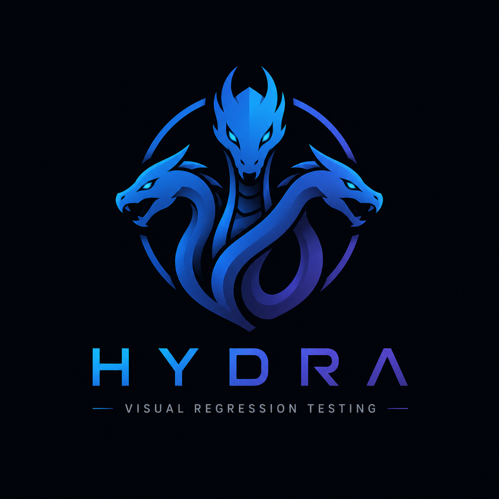

<div align="center">
  

  # HYDRA

  **Open-Source Automated Visual Regression Testing & AI Auto-Healing Platform**

  *Kill visual regressions between staging and production automatically before they break your launch.*

  ---
</div>

## 📌 Overview

**Hydra** is a modern, high-precision visual regression testing platform built for engineering teams. It performs pixel-by-pixel comparisons between **Staging** and **Production** environments, isolates layout shifts, maps them directly to DOM elements, and leverages **Gemini AI** to diagnose root causes.

### 🌟 Open Source vs. Pro Plan

* 🆓 **Open-Source (Free Tier)**: Unlimited visual regression capturing, sub-pixel difference detection, interactive visual debugger dashboard, and CI/CD CLI integration.
* ⚡ **Hydra Pro Plan**: Unlocks the **Autonomous AI Auto-Healing Agent**—an autonomous subagent that reads layout diffs, searches your repository, applies Tailwind/CSS class repairs directly in your codebase, and pushes candidate fixes to a Git branch automatically.

---

## 📊 Feature Comparison: Hydra vs. Market Alternatives

| Feature | Percy (BrowserStack) | Chromatic (Storybook) | Playwright / Cypress | **HYDRA (Open Source)** | **HYDRA PRO** |
| :--- | :---: | :---: | :---: | :---: | :---: |
| **Primary Focus** | Passive PNG Diffing | Component Snapshotting | E2E Code Assertions | **Active Visual Debugging** | **Autonomous Code Healing** |
| **Open Source** | ❌ Proprietary | ❌ Proprietary | ✅ Open Source | ✅ **100% Open Source** | ⚡ Cloud Managed |
| **Sub-Pixel Mismatch Engine** | ✅ Yes | ✅ Yes | ⚠️ Manual Config | ✅ **Pixelmatch Engine** | ✅ **Pixelmatch Engine** |
| **DOM Element Localization** | ❌ None | ❌ None | ❌ None | ✅ **DOM Bounding Inspector**| ✅ **DOM Bounding Inspector**|
| **AI Root Cause Analysis** | ❌ None | ❌ None | ❌ None | ✅ **Gemini AI Diagnosis** | ✅ **Gemini AI Diagnosis** |
| **Autonomous Code Fixes** | ❌ None | ❌ None | ❌ None | ❌ Manual Copy/Paste | ⚡ **AI Auto-Healing Agent** |
| **Candidate Branch PR Commits** | ❌ None | ❌ None | ❌ None | ❌ Manual | ⚡ **Automated Git Commits** |
| **Localhost Tunneling** | ⚠️ Complex Proxy | ⚠️ Complex Proxy | ❌ None | ✅ **Automatic Tunneling** | ✅ **Automatic Tunneling** |

---

## ⚡ Installation & Quick Start

### 1. Run via `npx` (No Installation Required)

Run Hydra directly from your terminal or CI environment using `npx`:

```bash
npx hydra-cli --project <YOUR_PROJECT_ID> --key <YOUR_API_KEY> --stagingUrl http://localhost:5173 --productionUrl https://your-app.com
```

### 2. Local Installation

Install `hydra-cli` in your project's `devDependencies`:

```bash
npm install --save-dev hydra-cli
```

Add a test script to your `package.json`:

```json
"scripts": {
  "test:visual": "hydra --project <YOUR_PROJECT_ID> --key <YOUR_API_KEY>"
}
```

---

## 🤖 CI/CD Integration (GitHub Actions)

Add Hydra to `.github/workflows/hydra.yml` to run automated visual checks on every Pull Request:

```yaml
name: Hydra Visual Testing & Auto-Healing

on:
  pull_request:
    branches: [ main ]

permissions:
  contents: write # Required for Auto-Healing agent to push candidate branches

jobs:
  visual-test:
    runs-on: ubuntu-latest
    steps:
      - name: Checkout Code
        uses: actions/checkout@v4

      - name: Set up Node.js
        uses: actions/setup-node@v4
        with:
          node-version: 20

      - name: Run Hydra Visual Scan
        run: npx hydra-cli --project ${{ secrets.HYDRA_PROJECT_ID }} --key ${{ secrets.HYDRA_API_KEY }} --stagingUrl ${{ steps.preview.outputs.url }} --productionUrl https://your-app.com
        env:
          GEMINI_API_KEY: ${{ secrets.GEMINI_API_KEY }}
```

---

## 🏗️ Architecture & How It Works

```text
 ┌────────────────────────────────────────────────────────┐
 │                   HYDRA FRONTEND                       │
 │  Interactive Dashboard, Visual Debugger, & Diff Slider │
 └──────────────────────────┬─────────────────────────────┘
                            │
                            ▼
 ┌────────────────────────────────────────────────────────┐
 │                   HYDRA BACKEND API                    │
 └──────┬───────────────────┬───────────────────┬─────────┘
        │                   │                   │
        ▼                   ▼                   ▼
┌──────────────┐    ┌──────────────┐    ┌──────────────┐
│ PHOTOGRAPHER │    │   SPOTTER    │    │  CONSULTANT  │
│  (Puppeteer) │    │ (Pixelmatch) │    │  (Gemini AI) │
│ Concurrent   │    │ Sub-pixel    │    │ Root Cause   │
│ Screenshots  │    │ Heatmaps     │    │ AI Diagnosis │
└──────────────┘    └──────────────┘    └──────┬───────┘
                                               │
                                               ▼ (Pro Plan)
                                       ┌──────────────┐
                                       │ AUTO-HEALER  │
                                       │ Code Swapper │
                                       │ & Git Commit │
                                       └──────────────┘
```

1. **Photographer (Puppeteer)**: Launches two headless browsers simultaneously in RAM to capture high-res PNGs of Staging and Production.
2. **Spotter (Pixelmatch)**: Overlays screenshots to compute exact pixel differences and maps them to DOM element coordinates.
3. **Consultant (Gemini AI)**: Analyzes mismatched HTML nodes and generates exact CSS/Tailwind class fix recommendations.
4. **Auto-Healer Agent (Pro Plan)**: Locates the target component file in your repository, applies the fix, and commits it to candidate branch `hydra-fix/layout-regressions`.

---

## 📄 License

Hydra Core is open-source software licensed under the **MIT License**.
